# gemini_hackathon — Architecture

> **Submission target:** Google All Things Agentic Hackathon, Aug 2026.
> **Last updated:** 2026-08-26 (Phase 0 + Phase 9 + Phase 11 + deploy)

## TL;DR

The product is a **single codebase** that serves three distinct
audiences (student / parent / teacher) across **eight jurisdictions**
(5 live + 3 future-expansion-pack), backed by a real Google ADK agent
with Gemini 3.5 Flash + Gemma 4 via Unsloth Studio. The user-visible
theming derives from a per-session identity, not a colour picker. Every
LLM call hits Vertex AI by default and falls back to AI Studio.
Every asset-generation call hits LiteLLM-backed Google image gen with
a deterministic fallback.

The seven "Fleet primitives" from the parent monorepo are renamed
here as the **Fortified Enterprise Fleet track's 4 pillars** (mapping in
the table below). They are implemented by exactly four modules
(`session/`, `agents/`, `model_registry.py`, `backend.py`).

## The 4-pillar mapping

| Fortified Enterprise Fleet pillar | Implementation in this repo |
|---|---|
| Agent Registry (discovery/versioning) | `gemini_hackathon.session.schema.SubnationMeta` + `gemini_hackathon.session.schema.BOARDMeta` — single source of truth for **8 subnations × 10 awarding bodies × 31 subjects** |
| Agent Runtime (long-running async execution) | `gemini_hackathon.agents.adk_gemini_agent.build_adk_agent` + `InMemoryRunner` — real `google.adk.agents.LlmAgent` with 5 tools (`lookup_outcome`, `retrieve_resources`, `find_similar_resources`, `retrieve_safeguarding`, `mark_answer`) |
| Memory Bank (persistent cross-session context) | `web/src/components/session/SessionContext.tsx` + `lib/session-helpers.ts` (localStorage) + the future Convex `userSessions` table — the session is per-tab, survives reload, signed by BetterAuth in production |
| Agent Identity (zero-trust access) | BetterAuth + PocketID (production) + the session cookie in dev — every session carries `subnation`, `role`, `cycle`, `subjects`, `palette`, `safeguarding` |

## Per-subnation user-context (the Phase 0 pivot)

The theming layer used to be a colour picker. After Phase 0, the palette
is **derived from the user's chosen subnation** via the session. The
session flows through every layer:

```
User → /onboarding (3-step picker: subnation → role → cycle)
     → /api/auth/* (BetterAuth) ← → PocketID (OIDC)
     → SessionContext (React) + lib/session-helpers.ts (localStorage)
     → home page quick actions depend on session.role
     → backend /api/* endpoints read session.subnation
     → ADK agent system prompt composes session.{subnation, role, cycle, subjects, safeguarding}
     → Gemini 3.5 Flash on Vertex AI is the primary path
```

The session is durable: it lives in Convex `userSessions` for production
deployed users, in PocketID-issued OIDC tokens for SSO, and in
localStorage for the dev experience. The **default subnation** is Ireland
(via NCCA), and the **secondary default** is England (via AQA/OCR/Pearson).
The future-expansion-pack subnations (Jersey / Guernsey / Isle of Man)
are rendered as locked "coming soon" cards in the onboarding picker.

## Mandatory-tech compliance (visible to judges at a glance)

The home page surfaces the policy in `<ModelPolicyBadge>`:

- **Tier 1**: `gemini-3.5-flash` (Vertex AI by default; AI Studio fallback)
- **Tier 2**: `unsloth/gemma-4-26B-A4B-it-GGUF` via Unsloth Studio :8888

Both Google models. The bonus-point rule ("integrate Google AI models
such as Gemma") is satisfied by Tier 2.

## Architecture — Mermaid diagram

```mermaid
flowchart TB
    classDef user fill:#00733B,color:#fff,stroke:#00733B
    classDef ui fill:#e3f2fd,stroke:#0E2D5C
    classDef auth fill:#fff3e0,stroke:#FFB81C
    classDef agent fill:#fce4ec,stroke:#c8102e
    classDef data fill:#e8f5e9,stroke:#00A651
    classDef gcp fill:#e3f2fd,stroke:#4285F4
    classDef notebook fill:#fffde7,stroke:#fbc02d

    User((👤 Student / Parent / Teacher)):::user

    subgraph Onboarding["🧭 First-visit onboarding (3-step picker)"]
        Step1["Pick subnation (Ireland / England default)"]:::ui
        Step1b["More options: NI / Scotland / Wales"]:::ui
        Step1c["Future pack: Jersey / Guernsey / IoM"]:::ui
        Step2["Pick role: student / parent / teacher"]:::ui
        Step3["Pick cycle (jc / lc / gcse / a-level / n5 / h / ah)"]:::ui
        Step1 --> Step2 --> Step3
    end

    subgraph Auth["🔐 BetterAuth + PocketID (OIDC)"]
        BetterAuth["BetterAuth server"]:::auth
        PocketID["PocketID OIDC provider"]:::auth
        BetterAuth <-->|OIDC discovery + JWKS| PocketID
    end

    subgraph Browser["🌐 Browser (TanStack Start)"]
        Home["/  (per-subnation home)"]:::ui
        ModelBadge["<ModelPolicyBadge><br/>Tier 1: gemini-3.5<br/>Tier 2: gemma-4"]:::ui
        Subjects["/subjects"]:::ui
        SubjectDetail["/subjects/$slug<br/>(per-subject notebook)"]:::ui
        SubjectNB["📓 marimo notebook<br/>(WASM, runs in browser)"]:::notebook
        Safeguarding["/safeguarding"]:::ui
        Find["/find-resources<br/>(cross-national)"]:::ui
        Agent["/agents (chat)"]:::ui
        Arch["/archipelago"]:::ui
        Compare["/compare<br/>(DuckDB-WASM leaderboard)"]:::ui
    end

    subgraph Backend["☁️ Python backend (Cloud Run, gemini_hackathon backend.py)"]
        LlmAgent["ADK LlmAgent (gemini-3.5)"]:::agent
        Tool1[lookup_outcome]:::agent
        Tool2[retrieve_resources]:::agent
        Tool3[find_similar_resources]:::agent
        Tool4[retrieve_safeguarding]:::agent
        Tool5[mark_answer]:::agent
        Compare2["compare (Phase 4)"]:::data
        ImageGen["image_gen router<br/>(FIBO + InvokeAI + LiteLLM/Google)"]:::data
        Progression["progression ledger<br/>(NCCA descriptors, unofficial certs)"]:::data
    end

    subgraph RAG["📚 RAG + chunking (Phase 2)"]
        Chunker["chunker (syllabus-aware, pypdfium2)"]:::data
        Embedder["BAAI/bge-m3 (1024-d multilingual)"]:::data
        Index["LanceDB (dev) / pgvector in Cloud SQL (prod)"]:::data
        Retriever["top-K across 13 sources"]:::data
    end

    subgraph Sources["📥 Official source PDFs"]
        LC[/"148 LC subject PDFs"/]:::data
        SafeguardingSrc[/"5 safeguarding PDFs"/]:::data
    end

    subgraph GCP["☁️ Google Cloud (deployed via cloudbuild.yaml)"]
        Vertex["Vertex AI (gemini-3.5)"]:::gcp
        CloudRun["Cloud Run service"]:::gcp
        CloudSQL["Cloud SQL (pgvector)"]:::gcp
        Gemma4["Unsloth Studio on GCE VM<br/>(gemma-4-26B-A4B)"]:::gcp
        Secrets["Secret Manager:<br/>UNSLOTH_API_KEY, GEMINI_API_KEY"]:::gcp
        Console["GCP Console screenshot<br/>(proof in demo video)"]:::gcp
    end

    subgraph Babylon3D["🎨 3D preview (Phase 9)"]
        BabylonCanvas["<BabylonScene><br/>WebGL2 + ArcRotate camera"]:::ui
        GodotExport["<GodotExporter><br/>.tscn download"]:::ui
    end

    %% Onboarding + Auth
    User --> Onboarding
    Onboarding -->|store session| Auth
    Auth -->|cookie| Browser

    %% Browser routes
    Browser --> SubjectNB
    SubjectNB -->|/api/agents/chat| Backend
    Home --> Backend
    Find --> Backend
    Agent --> Backend
    Compare --> Backend
    ImageGen -->|read generated asset| BabylonCanvas
    BabylonCanvas -->|download .tscn| GodotExport

    %% Backend → data + GCP
    LlmAgent --> RAG
    LlmAgent --> Progression
    Backend -->|via Vertex| GCP
    Backend -->|via LiteLLM| Gemma4

    %% Sources
    LC --> RAG
    SafeguardingSrc --> RAG
    RAG --> Index
```



## The 7 primitives → 4 pillars (this repo's naming)

| Primitive (this repo) | Equivalent Fleet primitive | Pillar |
|---|---|---|
| `gemini_hackathon.session` | Agent Registry + Memory Bank | Discovery / Lifecycle |
| `gemini_hackathon.agents.adk_gemini_agent` | Agent Runtime | Core Execution / State |
| `gemini_hackathon.backend.py` | Agent Gateway | Routing / Policy |
| `gemini_hackathon.call_llm._assert_model_allowed` | Model Armor | Security / Governance |
| `gemini_hackathon.observability` | Agent Observability | Telemetry |
| `gemini_hackathon.assets.image_gen` | Image-gen attached | Adjacent to AG-UI chat |
| `web/src/components/marimo/MarimoEmbed` | Marimo WASM surface | Interactive teaching |

## The 5 ADK tools

| Tool | When called | Returns |
|---|---|---|
| `lookup_outcome` | User asks "what does the syllabus say about X?" | Single learning outcome + page + outcome_id |
| `retrieve_resources` | User asks for resources on a topic | Top-K from the active subnation's index |
| `find_similar_resources` | User asks "what would help from OTHER jurisdictions?" | Cross-national resource list with provenance |
| `retrieve_safeguarding` | User asks about child safety / policy | The active subnation's policy + summary |
| `mark_answer` | User asks "mark this" | Per-question mark breakdown + NCCA descriptor |

All 5 are deterministic in dev (stub returns). When real backends are
attached (`GEMINI_API_KEY` + a RAG index), the same tool signatures
work without any frontend changes.

## Cache + observability

- Every `call_llm()` invocation emits a structlog event
  `llm.invocation` with `llm.tier`, `llm.role`, `llm.model_key`,
  `llm.backend`, `llm.latency_ms`, `llm.tokens_in/out`, and the
  fallback reason if applicable.
- Every ADK tool call wraps a `trace_agent()` context — visible in the
  model's structure.
- When Langfuse + MLflow env vars are set, every event also fans out
  to those backends via `observability.py:try_init_langfuse()` /
  `try_init_mlflow()`.
- The DuckDB-WASM surface reads the same `.duckdb` file the Python
  harness writes — same SQL dialect on both sides.

## What's on the web side

- `/` — onboarding or per-subnation home (depends on session state)
- `/subjects` — per-subnation subject catalogue
- `/subjects/$slug` — per-subject interactive notebook (marimo WASM)
- `/safeguarding` — active subnation's policy
- `/find-resources` — cross-national discovery
- `/agents` — ADK agent chat
- `/archipelago` — all 8 subnations side by side
- `/compare` — DuckDB-WASM leaderboard + document explorer
- `/api/themes` — palette JSON (filesystem-backed)
- `/api/models` — hackathon-profile models
- `/api/agents/find-resources` — session-aware cross-national discovery
- `/api/agents/chat` — ADK agent turn
- `/api/assets/generate` — image-gen pipeline
- `/api/duckdb` — DuckDB file (or 404 when not materialised)

## What's NOT in scope (deferred)

- **Convex deployment** — schema is defined, but `bunx convex dev` hasn't
  been run in this environment. Use `web/convex/schema.ts` once the user
  provisions a Convex team.
- **Cloud Run deploy** — `cloudbuild.yaml` + `cloud/terraform/cloud_run.tf`
  + `cloud/scripts/deploy-cloud-run.sh` are written and tested. Need
  `GCP_PROJECT`, `GCP_REGION`, `GCP_SA`, and 3 secret values to run.
