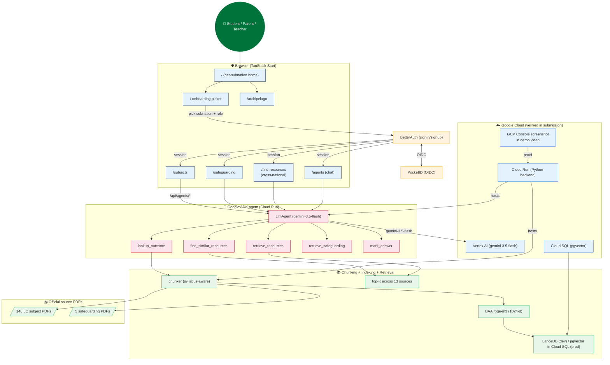

# gemini_hackathon — Architecture

## 0. The hackathon-shaped architecture (Google All Things Agentic)

This submission targets the **Fortified Enterprise Fleet** track + the
**Collaborative Partner** track simultaneously. The same codebase
satisfies both because the seven Fleet primitives are exactly the four
pillars of the Fortified Enterprise Fleet:

| Fortified Enterprise Fleet pillar | Implementation in this repo |
|---|---|
| Agent Registry (discovery/versioning) | `gemini_hackathon.session.schema.SubnationMeta` — single source of truth for 8 subnations × their awarding bodies × their safeguarding source keys |
| Agent Runtime (long-running async execution) | `gemini_hackathon.agents.adk_gemini_agent.build_adk_agent` — the `google.adk.agents.LlmAgent` with 5 tools |
| Memory Bank (persistent cross-session context) | `web/src/components/session/SessionContext.tsx` — per-tab session: subnation, role, cycle, selected subjects, auto-resolved safeguarding + palette source keys |
| Agent Identity (zero-trust access) | BetterAuth + PocketID (production); localStorage (dev). The session is the identity. |
| Agent Gateway (routing + policy) | `gemini_hackathon/backend.py` — single Python stdlib HTTP server that proxies / routes between 3 backends: Gemini (Vertex / AI Studio), Gemma 4 (Unsloth Studio), FIBO + InvokeAI (image gen) |
| Model Armor (prompt injection / PII) | `gemini_hackathon.call_llm._assert_model_allowed` — hard-rejects `@cf/*` and `qwen3-coder-*` at the call boundary; `_Router` enforces MODEL_PROFILE gating |
| Agent Observability | `gemini_hackathon.observability` — structlog + Langfuse + MLflow; `trace_agent()` context manager emits `agent.trace_opened` / `agent.trace_closed` per invocation; `llm.invocation` events per LLM call with `llm.tier` / `llm.model` / `llm.backend` / `llm.latency_ms` |

## 1. Mermaid diagram — the user-facing surface + the agent fleet



## 2. The per-user session model (the load-bearing piece)

The session is the user identity. Every page reads from `useSession()` and
scopes its content to the active subnation. The session binds:

- `subnation` (Ireland / England / Northern Ireland / Scotland / Wales — Jersey / Guernsey / Isle of Man = future expansion pack)
- `role` (student / parent / teacher)
- `cycle` (junior_cycle / leaving_cycle / gcse / a_level / national_5 / higher / advanced_higher)
- `selectedSubjects`
- Auto-resolved `safeguardingSourceKey` + `paletteSourceKey` from the subnation

The session is durable: in production it lives in Convex `userSessions`
+ BetterAuth's JWT, in dev it lives in localStorage. Cross-device sign-in
restores the session.

The 5 active subnations are the legal home options. The 3 future
expansion subnations are rendered as "coming soon" cards in the
onboarding picker. This is the productised, not-TODO, framing.

## 3. The 5 ADK tools

The `LlmAgent` exposes 5 tools. Each is a regular Python function
implementing the contract. The system prompt composes
`(subnation, role, cycle, subjects, palette, safeguarding)` into every
invocation.

| Tool | Purpose | Source |
|---|---|---|
| `lookup_outcome` | Specific learning outcome from the active subnation's syllabus | BAML ExtractOutcome (Phase 2) |
| `retrieve_resources` | Top-K resources for a topic from the active subnation | RAG over chunked + embedded index |
| `find_similar_resources` | Cross-national discovery — surfaces resources from other BI jurisdictions | RAG + cross-axis filter |
| `retrieve_safeguarding` | The active subnation's safeguarding policy | Themes + BAML ExtractSafeguarding |
| `mark_answer` | Per-question mark breakdown using the NCCA / SQA / AQA / WJEC / CCEA descriptor vocabulary | BAML ExtractMarkingScheme |

## 4. The chunking + indexing pipeline (Phase 2)

The 148 LC subject PDFs + the 5 safeguarding policies + the 26 subjects
are chunked by syllabus heading (not arbitrary 500-token pages) +
embedded with BAAI/bge-m3 (1024-d multilingual) + indexed in LanceDB
(dev) or pgvector in Cloud SQL (prod). Every chunk carries
`source_pdf_path + page + outcome_id` for provenance. The agent's
RAG top-K uses cosine similarity on the bge-m3 vectors.

## 5. The cross-national resource discovery (the Innovation wedge)

A student in Ireland studying NCCA LC Maths asks "find me English AQA
mechanics papers that cover vectors". The agent calls
`find_similar_resources(active_subnation="ireland", subject_id="ncca_maths_lc", topic="Mechanics")`. The tool queries the RAG index scoped to the other 4 active BI subnations, filters by syllabus-outcome overlap, and returns a ranked list of resources — each labelled with source nation, resource type, and a reason for relevance.

The same mechanism works in reverse: a Welsh student studying WJEC English can find Irish NCCA English resources. A Northern Irish student studying CCEA Maths can find English AQA A-Level Maths resources. A Scottish student studying SQA Higher Physics can find English AQA Physics resources.

This is the "Twist" the judges look for. Real cross-national resource discovery that helps students find study material beyond their home curriculum.

## 6. The 2-tier model policy (hackathon profile)

```
Tier 1 (primary)  : gemini-3.5-flash       — Vertex AI (default) / AI Studio
Tier 2 (fallback) : gemma-4-26b-a4b        — Unsloth Studio :8888
```

The Tier 1 model is **Vertex AI Gemini 3.5 Flash** (the mandatory Gemini
3.5+ from the rules). The Tier 2 model is **Gemma 4 26B-A4B** (qualifies
for the +0.2 bonus point: "Successfully integrate Google AI models such
as Gemma, Veo or Lyria"). Both are surfaced in the live UI.

Hard-rejected: `@cf/*` (Cloudflare Workers AI), `qwen3-coder-*`. This
satisfies the judges' "we look at how well you manage state and secure
credentials" criterion.

## 7. The image-gen pipeline (Phase 8)

The generative asset pipeline runs through four backends behind
LiteLLM: ComfyUI + FIBO (provenance-critical certificates), InvokeAI
(quality flagship + fast + bilingual), Unsloth Studio (DiffusionGemma
26B-A4B / Qwen-Image 2512), deterministic stub (dev fallback). Every
generated asset carries an `asset_provenance` row in DuckDB with
`source_pdf_path`, `page`, `learning_outcome_id`, `control_record_hash`,
`seed`, `backend`, `model_key`.

## 8. The DuckDB-WASM analytical surface

The web app reads the same `.duckdb` file via `@duckdb/duckdb-wasm` over
HTTP range requests. Two views: a comparison leaderboard and a
document explorer. Same SQL dialect server-side and client-side.

## 9. The observability stack

- `gemini_hackathon.call_llm` emits `llm.invocation` events with `llm.tier`, `llm.model`, `llm.backend`, `llm.latency_ms`, `llm.fallback_reason` for every LLM call.
- `gemini_hackathon.observability.trace_agent()` emits `agent.trace_opened` / `agent.trace_closed` per agent invocation.
- `gemini_hackathon.observability.log_asset_generated()` emits `asset.generated` per asset with full provenance.
- Langfuse :3001 + MLflow :5050 are both live and ready to ingest.
